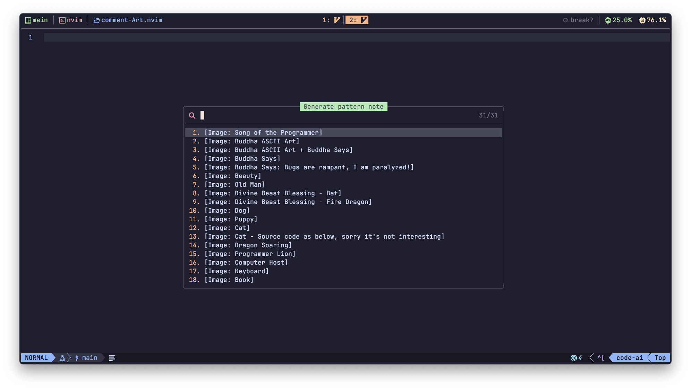
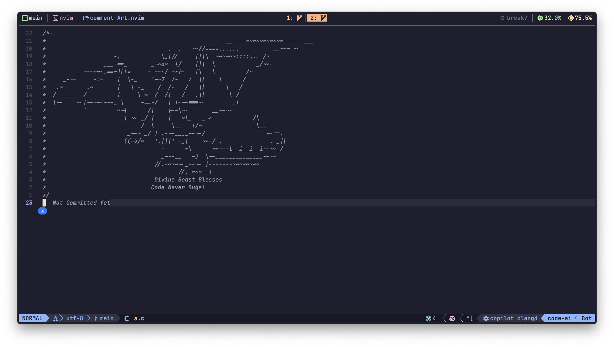

# Comment-Art.nvim 🎨

[English](README.md) | [中文](README_zh-CN.md)

> **Generate beautiful comment art in Neovim**  
> **创建精美的 Neovim 注释艺术图案**  
> Multi-language ASCII art generator with custom patterns | 支持自定义图案的多语言字符画生成工具

**Comment-Art.nvim** is a Neovim plugin for quickly generating multi-language supported comment patterns (ASCII Art) to enhance visual separation and aesthetics in code documentation.

## 📸 Screenshots

### Selector


### Buddha's Blessing


### Scallion Dancer


## ✨ Features

- **Multi-language support**： Supports major programming languages including C, C++, JavaScript, TypeScript, Python, Lua, Java, Rust, etc.
- **Built-in pattern library**： Includes fun preset patterns like "Buddha's Blessing", "Mythical Creature Protection", and "Scallion Dance"
- **Quick insertion**：Insert directly at cursor position via command or keyboard shortcut

## 📦 Installation

### Using [packer.nvim](https://github.com/wbthomason/packer.nvim)

```lua
use {
  'ChuYanLon/comment-Art',
  config = function()
    require('comment-art').setup()
  end
}
```

### Using [lazy.nvim](https://github.com/folke/lazy.nvim)

```lua
{
  'ChuYanLon/comment-Art',
  opts = {},
}
```

## ⚙️ Default Configuration

```lua
{
  data_path = vim.fn.stdpath('data') .. '/lazy/comment-Art/lua/comment-art/data.txt',
  data_en_path = vim.fn.stdpath('data') .. '/lazy/comment-Art/lua/comment-art/data-en.txt',
  language = 'english', -- 'english' or 'chinese' 
  prompt = {
    title_en = 'Generate pattern note:',
    title="生成图案注释:",
  },
  rules = {
    ['c'] = { prefix = '/* ', suffix = '*/', line_prefix = '* ', lines = true },
    ['cpp'] = { prefix = '/* ', suffix = '*/', line_prefix = '* ', lines = true },
    ['javascript'] = { prefix = '/* ', suffix = '*/', line_prefix = '* ', lines = true },
    ['typescript'] = { prefix = '/* ', suffix = '*/', line_prefix = '* ', lines = true },
    ['css'] = { prefix = '/* ', suffix = '*/', line_prefix = '* ', lines = true },
    ['scss'] = { prefix = '/* ', suffix = '*/', line_prefix = '* ', lines = true },
    ['vue'] = { prefix = '/* ', suffix = '*/', line_prefix = '* ', lines = true },
    ['javascriptreact'] = { prefix = '/* ', suffix = '*/', line_prefix = '* ', lines = true },
    ['typescriptreact'] = { prefix = '/* ', suffix = '*/', line_prefix = '* ', lines = true },
    ['python'] = { prefix = "'''", suffix = "'''", line_prefix = '', lines = true },
    ['sh'] = { prefix = '###', suffix = '###', line_prefix = '# ', lines = true },
    ['zsh'] = { prefix = '###', suffix = '###', line_prefix = '# ', lines = true },
    ['lua'] = { prefix = '--[[ ', suffix = ']]--', line_prefix = '', lines = true },
    ['java'] = { prefix = '/* ', suffix = '*/', line_prefix = '* ', lines = true },
    ['rust'] = { prefix = '/* ', suffix = '*/', line_prefix = '* ', lines = true },
    ['go'] = { prefix = '/* ', suffix = '*/', line_prefix = '', lines = true },
    ['less'] = { prefix = '// ', suffix = '', line_prefix = '// ' },
    ['html'] = { prefix = '<!-- ', suffix = '-->', line_prefix = '* ', lines = true },
    ['markdown'] = { prefix = '<!-- ', suffix = '-->', line_prefix = '', lines = true },
  }
}
```

## 📜 Command

### `:CommentArt`

## 📖 Usage

```lua
vim.keymap.set('n', '<leader>cs', ':CommentArt<CR>', { desc = 'Generate pattern note' })
```

## 📜 Contributions
PRs and Issues are welcome! Please share your creative patterns or feature suggestions.

## 📄 License
This project uses the [MIT License](./LICENSE) . You can freely use, modify, and distribute the code while retaining the author information.
