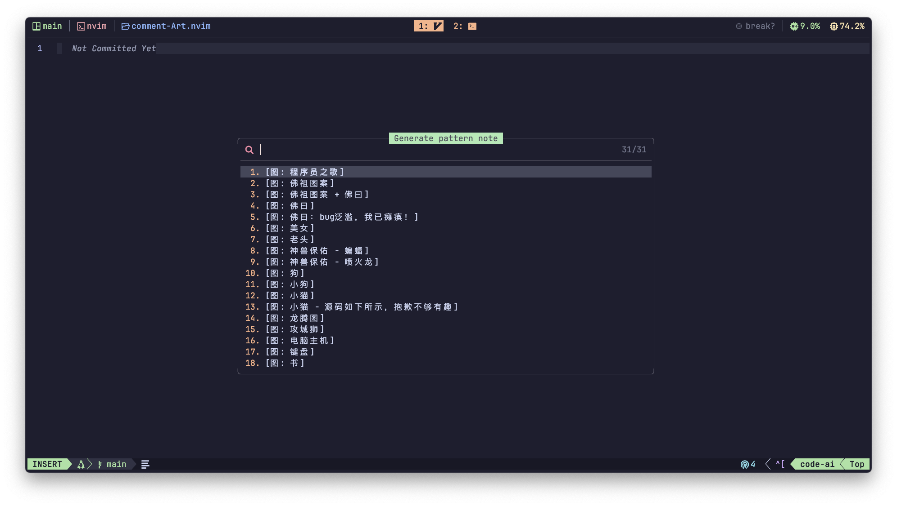
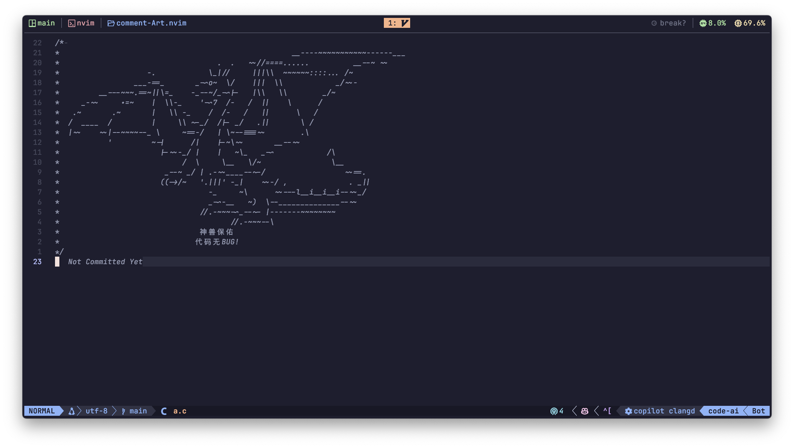
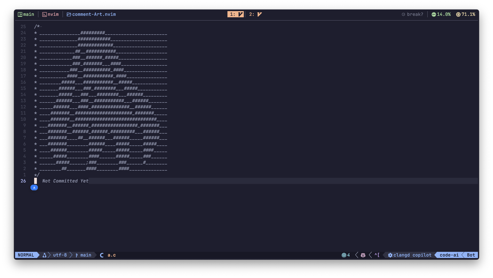

# Comment-Art.nvim 🎨

> **Generate beautiful comment art in Neovim**  
> **创建精美的 Neovim 注释艺术图案**  
> Multi-language ASCII art generator with custom patterns | 支持自定义图案的多语言字符画生成工具

**Comment-Art.nvim** 是一个 Neovim 插件，用于快速生成多语言支持的注释图案（ASCII Art），提升代码注释的视觉分隔性和美观度。

## 📸 截图

### 选择器


### 佛祖保佑永无bug


### 摔葱少女


## ✨ 功能特性

- **多语言支持**：支持 C、C++、JavaScript、TypeScript、Python、Lua、Java、Rust 等主流编程语言。 
- **预设图案库**：内置佛祖保佑永无bug、神兽护体、甩葱少女等好玩有趣的图像注释
- **快速插入**：通过命令或快捷键直接插入到光标位置。

## 📦 安装

### 使用 [packer.nvim](https://github.com/wbthomason/packer.nvim)

```lua
use {
  'ChuYanLon/comment-Art',
  config = function()
    require('comment-art').setup({
       language = 'chinese'
    })
  end
}
```

### 使用 [lazy.nvim](https://github.com/folke/lazy.nvim)

```lua
{
  'ChuYanLon/comment-Art',
  opts = {
    language = 'chinese',
  },
}
```

## ⚙️ 默认值

```lua
{
  data_path = vim.fn.stdpath('data') .. '/lazy/comment-Art/lua/comment-art/data.txt',
  data_en_path = vim.fn.stdpath('data') .. '/lazy/comment-Art/lua/comment-art/data-en.txt',
  language = 'english', -- 'english' or 'chinese' 
  rules = {
    ['c'] = { prefix = '/* ', suffix = '*/', line_prefix = '* ', lines = true },
    ['cpp'] = { prefix = '/* ', suffix = '*/', line_prefix = '* ', lines = true },
    ['javascript'] = { prefix = '/* ', suffix = '*/', line_prefix = '* ', lines = true },
    ['typescript'] = { prefix = '/* ', suffix = '*/', line_prefix = '* ', lines = true },
    ['css'] = { prefix = '/* ', suffix = '*/', line_prefix = '* ', lines = true },
    ['scss'] = { prefix = '/* ', suffix = '*/', line_prefix = '* ', lines = true },
    ['vue'] = { prefix = '/* ', suffix = '*/', line_prefix = '* ', lines = true },
    ['javascriptreact'] = { prefix = '/* ', suffix = '*/', line_prefix = '* ', lines = true },
    ['typescriptreact'] = { prefix = '/* ', suffix = '*/', line_prefix = '* ', lines = true },
    ['python'] = { prefix = "'''", suffix = "'''", line_prefix = '', lines = true },
    ['sh'] = { prefix = '###', suffix = '###', line_prefix = '# ', lines = true },
    ['zsh'] = { prefix = '###', suffix = '###', line_prefix = '# ', lines = true },
    ['lua'] = { prefix = '--[[ ', suffix = ']]--', line_prefix = '', lines = true },
    ['java'] = { prefix = '/* ', suffix = '*/', line_prefix = '* ', lines = true },
    ['rust'] = { prefix = '/* ', suffix = '*/', line_prefix = '* ', lines = true },
    ['go'] = { prefix = '/* ', suffix = '*/', line_prefix = '', lines = true },
    ['less'] = { prefix = '// ', suffix = '', line_prefix = '// ' },
    ['html'] = { prefix = '<!-- ', suffix = '-->', line_prefix = '* ', lines = true },
    ['markdown'] = { prefix = '<!-- ', suffix = '-->', line_prefix = '', lines = true },
  }
}
```

## 📜 命令

### `:CommentArt`

## 📖 使用方法

```lua
vim.keymap.set('n', '<leader>cs', ':CommentArt<CR>', { desc = 'Generate pattern note' })
```

## 📜 贡献
欢迎提交 PR 或 Issues！如果你有好的图案或功能建议，请随时分享。

## 📄 许可证
本项目采用 [MIT 许可证](./LICENSE)，你可以自由使用、修改和分发代码，但请保留原作者信息。
